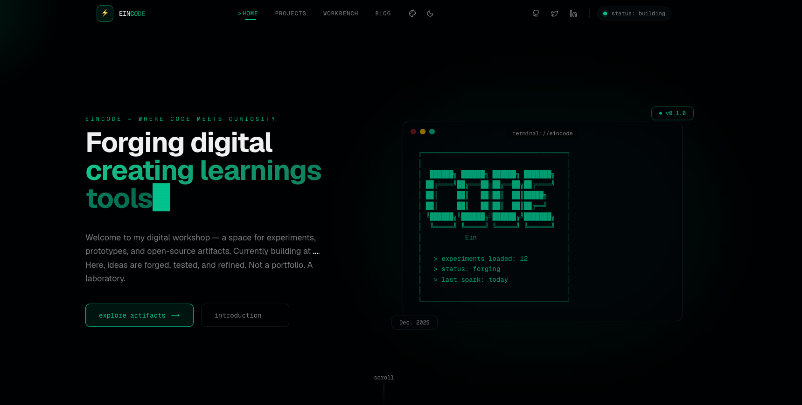

# ⚡ EINCODE — Where Code Meets Curiosity

> **Ein's Digital Laboratory.** Not a portfolio. A laboratory. Experiments, prototypes, and open-source artifacts — forged, tested, and refined in public.

<p align="center">
  
</p>

<p align="center">
  <a href="https://eindev.ir"></a>
  <a href="https://nextjs.org"></a>
  <a href="https://react.dev"></a>
  <a href="https://tailwindcss.com"></a>
  <a href="https://www.typescriptlang.org"></a>
</p>

<p align="center">
  
  
  
  
</p>

---

## Table of Contents

- [Philosophy](#philosophy)
- [Live Demo](#-live-demo)
- [Features](#-features)
- [Tech Stack](#-tech-stack)
- [Project Structure](#-project-structure)
- [Getting Started](#-getting-started)
- [Content Authoring — MDX](#-content-authoring--mdx)
- [Routes & App Router](#-routes--app-router)
- [Design System](#-design-system)
- [SEO & Performance](#-seo--performance)
- [Scripts](#-scripts)
- [Deployment](#-deployment)
- [Contributing](#-contributing)
- [License & Author](#-license--author)

---

## Philosophy

**EINCODE** is built as a *digital workshop*, not a static showcase:

- **Forge in public** — every experiment ships with source, live demo, and lab notes.
- **Lab over gallery** — WIP is first-class. Progress bars, status indicators, and field notes tell the story of *how* it was built.
- **Content as code** — blog posts are `MDX` files versioned in `content/` (`content/building-linux-distro-from-scratch.mdx:1`), rendered with `next-mdx-remote` + `shiki` + `rehype`.
- **Modern by default** — Next.js 16 App Router, React 19 Server Components, Tailwind v4 CSS-first config, `next/font` optimized fonts.

> If you want a template for a fast, SEO-perfect, MDX-powered personal site that still feels like a hacker lab — this is it.

---

## 🔗 Live Demo

| Environment | URL |
|---|---|
| **Production** | [https://eindev.ir](https://eindev.ir) |
| **Alt Domain** | `https://eincode.dev` (see `.env.example:2`) |

Preview the hero's typewriter, projects grid, lab notes, and workbench directly on the homepage — `app/page.tsx:10` composes `Header`, `HeroSection`, `ProjectsGrid`, `LabNotes`, `Workbench`, `Footer`.

---

## ✨ Features

| Area | What you get |
|---|---|
| **Hero Lab** | Typewriter role rotation (`"building interfaces"`, `"crafting code"`), ASCII terminal, floating version badge — `components/hero-section.tsx:6` |
| **Artifacts Grid** | 8 open-source projects with `shipped / in-progress / archived` filters, stars/forks, glassmorphism & hover-lift — `components/projects-grid.tsx:7` |
| **Workbench** | Live WIP terminal with progress bars (60–90%), `~/ehsanghaffar/active` header — `components/workbench.tsx:4` |
| **Lab Notes** | 4 field notes with category pills & gradient hovers — `components/lab-notes.tsx:7` |
| **Blog Engine** | File-based MDX in `content/` (8 posts), `gray-matter` frontmatter, GFM, autolink headings, pretty-code — `lib/mdx-utils.ts:8` |
| **Theming** | Dark/light/system with `next-themes`, `ThemeProvider` (`app/layout.tsx:100`), `ThemeToggle` + `ThemeChanger`, OKLCH tokens, `globals.css:8` |
| **MDX Pipeline** | `next-mdx-remote` + `rehype-slug` + `rehype-autolink-headings` + `rehype-pretty-code` (shiki) + `remark-gfm` — `components/mdx-remote.tsx:1` |
| **SEO Mastery** | `metadata` (`app/layout.tsx:25`), JSON-LD (`lib/structured-data.ts:32`), `sitemap.ts:4` + `robots.ts:3`, OG image `public/og-image.png` |
| **A11y + Perf** | `next/font` (Geist, Geist_Mono, Space_Grotesk), AVIF/WebP images (`next.config.mjs:5`), reduced-motion, touch targets 44px — `app/globals.css:640` |
| **UI Kit** | shadcn/ui on Radix primitives — 20+ components in `components/ui/` (`accordion`, `dialog`, `dropdown-menu`, etc.) |
| **Analytics** | Vercel Analytics injected in root layout — `app/layout.tsx:103` |

---

## 🧱 Tech Stack

### Core

| Tech | Version | Purpose | Config |
|---|---|---|---|
| **Next.js** | `16.1.0` | App Router, Turbopack, SSR/SSG, Metadata API | `next.config.mjs:1` |
| **React** | `19.2.3` | Server Components, `use client` islands | `package.json:64` |
| **TypeScript** | `5.9.3` | Strict types, path alias `@/*` | `tsconfig.json:25` |
| **Tailwind CSS** | `4.1.9` | CSS-first `@import "tailwindcss"`, OKLCH, `@plugin typography` | `app/globals.css:1` |

### UI & Styling

| Tech | Details |
|---|---|
| **Radix UI** | 16 primitives — `accordion`, `dialog`, `popover`, `tabs`, `toast`, etc. — `package.json:24` |
| **shadcn/ui** | `components.json` + `components/ui/` + `lib/utils.ts:1` (`cn` = `clsx` + `tailwind-merge`) |
| **Lucide React** | `0.454.0` icons throughout |
| **next-themes** | `0.4.6` class-based dark mode |
| **tw-animate-css** | `1.3.3` animation utilities |

### Content & Markdown

| Tech | Usage |
|---|---|
| **next-mdx-remote** `6.0.0` | Serialize & hydrate MDX |
| **gray-matter** `4.0.3` | Frontmatter parsing — `lib/mdx-utils.ts:3` |
| **remark-gfm** `4.0.1` | GitHub Flavored Markdown |
| **rehype-slug / autolink-headings / pretty-code** | Anchors + Shiki highlighting |
| **shiki** `3.22.0` | Syntax highlighting |
| **@tailwindcss/typography** `0.5.19` | Prose styling `.prose` — `app/globals.css:163` |

### Tooling

| Tech | Version |
|---|---|
| **pnpm** | `>=9` recommended (lockfile `pnpm-lock.yaml`) |
| **ESLint** | `eslint .` — `package.json:18` |
| **Vercel Analytics** | `latest` |
| `zod` `3.25`, `react-hook-form` `7.60`, `recharts` `2.15`, `date-fns` `4.1`, `embla-carousel`... | Extra UI deps pre-wired |

---

## 📁 Project Structure

```
eincode/
├── app/                          # Next.js 16 App Router — app/layout.tsx:92
│   ├── (public)/                 # Route group (shared layout)
│   │   ├── blog/
│   │   │   ├── [postSlug]/page.tsx  # Dynamic MDX post — lib/mdx-utils.ts:34
│   │   │   └── page.tsx             # Blog index
│   │   ├── projects/page.tsx
│   │   ├── workbench/page.tsx
│   │   ├── notes/page.tsx
│   │   ├── introduction/page.tsx
│   │   └── layout.tsx
│   ├── page.tsx                  # Homepage — composes 6 sections
│   ├── layout.tsx                # Root layout, fonts, metadata, ThemeProvider
│   ├── globals.css               # Tailwind v4 + OKLCH tokens + animations
│   ├── sitemap.ts                # Dynamic sitemap from MDX — app/sitemap.ts:4
│   ├── robots.ts                 # Robots.txt — app/robots.ts:3
│   ├── error.tsx / not-found.tsx
│   └── favicon.ico
├── components/
│   ├── hero-section.tsx          # Typewriter + ASCII terminal
│   ├── projects-grid.tsx         # Filterable artifacts grid
│   ├── workbench.tsx             # Terminal-style WIP list
│   ├── lab-notes.tsx             # Field notes grid
│   ├── header.tsx / footer.tsx
│   ├── cursor-glow.tsx
│   ├── mdx-remote.tsx / mdx-components.tsx
│   ├── theme-provider.tsx / theme-toggle.tsx / theme-changer.tsx
│   └── ui/                       # 20+ shadcn/ui components
├── content/                      # MDX blog source (8 posts)
│   ├── building-linux-distro-from-scratch.mdx
│   ├── mcp-protocol-llm-applications.mdx
│   ├── nextjs-16-tailwind-v4-migration.mdx
│   └── ... (5 more)
├── lib/
│   ├── mdx-utils.ts              # getAllMDXPosts(), getMDXPostBySlug()
│   ├── blog-data.tsx             # Legacy in-memory posts + helpers
│   ├── structured-data.ts        # JSON-LD: BlogPosting, WebSite, Person
│   ├── themes.ts / utils.ts
├── types/mdx.ts                  # BlogPostFrontmatter, BlogPost
├── public/
│   ├── og-image.png / og-images/
│   ├── icon.svg / apple-icon.png
│   └── site.webmanifest
├── docs/                         # architecture.md, performance.md, etc.
├── next.config.mjs               # AVIF/WebP, deviceSizes
├── components.json               # shadcn config
├── tsconfig.json                 # @/* alias
└── package.json
```

---

## 🚀 Getting Started

### Prerequisites

- **Node.js** `>=18` (20+ recommended)
- **pnpm** — `npm i -g pnpm` or see [pnpm.io](https://pnpm.io)
- Git

### 1. Clone & Install

```bash
git clone https://github.com/ehsanghaffar/eincode.git
cd eincode
pnpm install
```

### 2. Environment

```bash
cp .env.example .env
# edit .env
```

| Variable | Required | Default | Description |
|---|---|---|---|
| `NEXT_PUBLIC_SITE_URL` | No | `https://eindev.ir` | Canonical URL for metadata/sitemap — `app/layout.tsx:26` |
| `NEXT_PUBLIC_GITHUB_URL` | No | `https://github.com/ehsanghaffar` | Social link |
| `NEXT_PUBLIC_TWITTER_URL` | No | — | Social link |
| `NEXT_PUBLIC_LINKEDIN_URL` | No | — | Social link |

> No database, no API keys. The site is fully static + MDX. Analytics is zero-config on Vercel.

### 3. Run Dev Server (Turbopack)

```bash
pnpm dev
# → http://localhost:3000
```

Hot reload is near-instant with Next.js 16 Turbopack.

### 4. Production Build

```bash
pnpm build
pnpm start
# → http://localhost:3000 (optimized)
```

---

## ✍️ Content Authoring — MDX

All posts live in `content/*.mdx` and are read at build time via `lib/mdx-utils.ts:8`.

### Frontmatter Schema — `types/mdx.ts:1`

```yaml
---
title: "Building a Linux Distro from Scratch"
excerpt: "A comprehensive guide to compiling the kernel..."
date: "2025-11-15"          # display date
dateISO: "2025-11-15"       # used for sorting — lib/mdx-utils.ts:29
category: "systems"          # systems | ai | frontend
readTime: "12 min read"
tags: ["linux", "kernel", "devops"]
author: "Ehsan Ghaffar"
published: true              # false = draft, filtered out
image: "/og-images/my-post.png"  # optional
---
```

### Create a New Post

```bash
# 1. Add file
touch content/my-new-post.mdx

# 2. Write MDX — supports GFM, code blocks with Shiki, headings with anchors
```

````mdx
---
title: "My New Post"
excerpt: "One-line hook for the blog index."
date: "2026-08-23"
dateISO: "2026-08-23"
category: "frontend"
readTime: "5 min read"
tags: ["nextjs", "tailwind"]
published: true
---

## Introduction

Hello MDX!

```ts
export const hello = "world"
```

> Tip: headings auto-get `id` + anchor links via `rehype-slug` + `rehype-autolink-headings`.
````

No restart needed in dev — just refresh. For production, the post is auto-added to `sitemap.ts:48`.

### Helpers

```ts
import { getAllMDXPosts, getMDXPostBySlug, getAllMDXCategories } from "@/lib/mdx-utils"
import { getPostBySlug, getRelatedPosts } from "@/lib/blog-data" // legacy helper
```

---

## 🗺 Routes & App Router

| Route | File | Description |
|---|---|---|
| `/` | `app/page.tsx:10` | Hero + Projects + Lab Notes + Workbench + Footer |
| `/blog` | `app/(public)/blog/page.tsx` | Paginated MDX listing |
| `/blog/[postSlug]` | `app/(public)/blog/[postSlug]/page.tsx` | MDX render + JSON-LD + related posts |
| `/projects` | `app/(public)/projects/page.tsx` | Full artifacts archive |
| `/workbench` | `app/(public)/workbench/page.tsx` | Dedicated WIP view |
| `/notes` | `app/(public)/notes/page.tsx` | Lab notes archive |
| `/introduction` | `app/(public)/introduction/page.tsx` | About / intro |
| `/sitemap.xml` | `app/sitemap.ts:4` | Auto-generated from static + MDX routes |
| `/robots.txt` | `app/robots.ts:3` | `allow: /`, `disallow: /api/, /_next/` |

Static routes use `weekly`/`daily` changeFrequency; blog posts use `monthly` with `priority: 0.7`.

---

## 🎨 Design System

### Tokens — `app/globals.css:8`

- **OKLCH palette** — `oklch(0.5 0.22 170)` primary (teal) for both light & dark, with tailored lightness.
- **CSS-first Tailwind v4** — no `tailwind.config.js`; all tokens in `@theme inline` — `app/globals.css:86`.
- **Fonts** — `Geist` (sans), `Geist_Mono` (mono), `Space_Grotesk` via `next/font/google` with `display: swap` + CSS variables — `app/layout.tsx:9`.

### Utilities

- `.glass` / `.glass-strong` — backdrop-blur + saturate
- `.hover-lift` — `translateY(-4px)` + shadow
- `.cursor-glow` — 400px radial gradient following cursor (hidden on mobile) — `app/globals.css:188`
- `.scanlines` — subtle repeating linear gradient overlay — `app/globals.css:206`
- Animations: `fade-in-up`, `scale-in`, `slide-in-*`, `float`, `pulse-glow`, `shimmer` + `stagger-1..8`

### Theming

```tsx
// app/layout.tsx:100
<ThemeProvider attribute="class" defaultTheme="dark" enableSystem storageKey="theme-mode">
```
Toggle via `components/theme-toggle.tsx` and multi-theme switcher `components/theme-changer.tsx` + `lib/themes.ts`.

---

## 🔍 SEO & Performance

- **Metadata API** — `title.template`, `openGraph`, `twitter`, `robots`, `icons`, `manifest` — `app/layout.tsx:25`
- **JSON-LD** — `WebSite` + `Person` on homepage (`app/page.tsx:12`), `BlogPosting` + `BreadcrumbList` on posts — `lib/structured-data.ts:3`
- **Sitemap & Robots** — dynamic, MDX-aware
- **Images** — `formats: ['image/avif','image/webp']`, 8 deviceSizes — `next.config.mjs:5`
- **Fonts** — `next/font` self-hosted, no CLS
- **A11y** — `prefers-reduced-motion`, 44px touch targets, `focus-visible` rings, semantic headings
- **Perf** — Turbopack dev, `transform: translateZ(0)` hardware accel, blur reduction on touch devices — `app/globals.css:140`

Check deeper dives in `docs/performance.md`, `docs/accessibility.md`, `docs/architecture.md`.

---

## 📜 Scripts

| Command | Description | Source |
|---|---|---|
| `pnpm dev` | Start dev server (Turbopack) | `next dev` |
| `pnpm build` | Production build | `next build` |
| `pnpm start` | Serve production build | `next start` |
| `pnpm lint` | ESLint | `eslint .` |
| `pnpm analyze` | Bundle analyzer | `next experimental-analyze` |

---

## ☁️ Deployment

**Optimized for Vercel** — zero config.

```bash
# via CLI
pnpm i -g vercel
vercel --prod

# or connect GitHub repo → Vercel auto-deploys on push
```

Other platforms (Netlify, Docker, Node server): `pnpm build && pnpm start` serves on `PORT` (default 3000). For Docker, see the sibling template [next16-docker-tw4-starter](https://github.com/ehsanghaffar/next16-docker-tw4-starter).

Environment on Vercel: set `NEXT_PUBLIC_SITE_URL` to your production domain.

---

## 🤝 Contributing

Contributions are welcome — especially fixes to MDX rendering, a11y, or new lab notes!

1. Open an issue for larger changes
2. Branch: `git checkout -b feat/my-change`
3. Commit with clear messages
4. PR with screenshots for UI changes, and ensure `pnpm build` passes

Code style: TypeScript strict, `eslint .`, Tailwind v4 utilities, Radix + shadcn patterns.

---

## 📄 License & Author

MIT © 2024–2025 **Ehsan Ghaffar** — [github.com/ehsanghaffar](https://github.com/ehsanghaffar) · [eindev.ir](https://eindev.ir) · [twitter.com/ehsanghaffar](https://twitter.com/ehsanghaffar)

> Built with ❤️, `oklch`, and a healthy obsession with `next/font`.

---

<p align="center">
  <sub>Forge. Break. Rebuild. Repeat. — EINCODE</sub>
</p>
